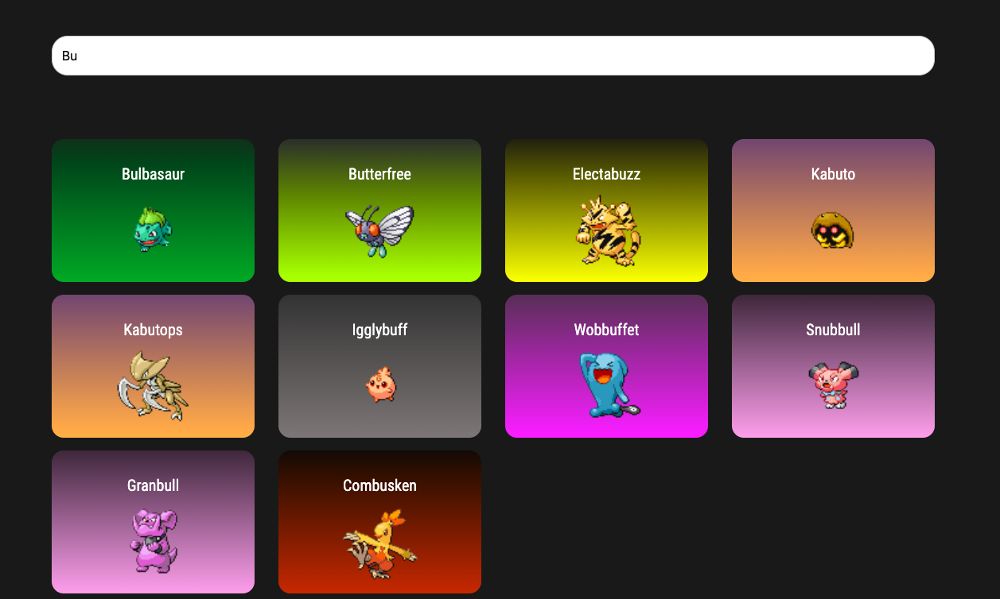
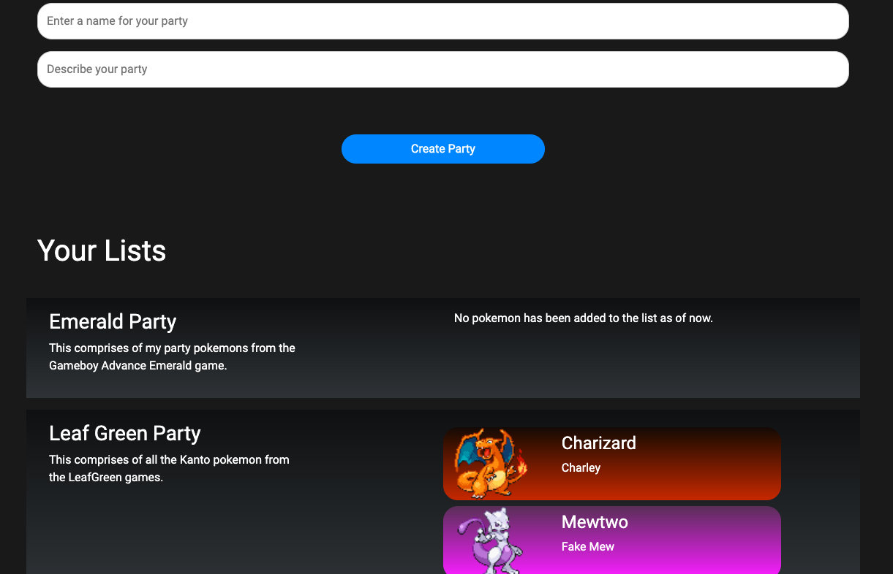

# php_pokemon_app
An aesthetically pleasing Pokemon web database interface coded in PHP.

Pokemon Sprites downloaded from: [https://pokemondb.net/sprites](https://pokemondb.net/sprites)

Pokemon dataset downloaded from: [https://gist.github.com/armgilles/194bcff35001e7eb53a2a8b441e8b2c6](https://gist.github.com/armgilles/194bcff35001e7eb53a2a8b441e8b2c6)

#### First Version:
Shows list of Kanto, Jhoto and Hoenn pokemon with search functionality.

Allows user to create new lists and also add pokemon for each list

